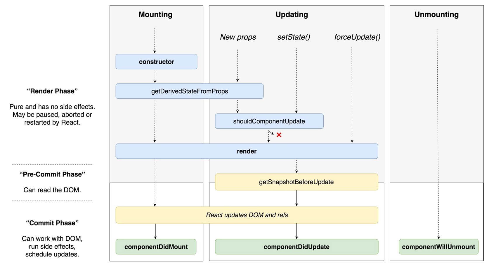
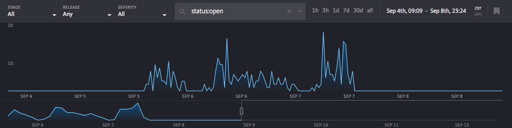
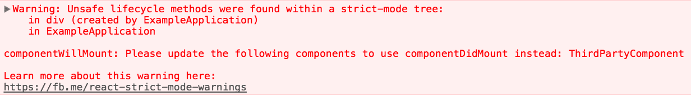

# React 16.0 to 16.5 major upgrade feature example samples

> 大约一年前，React 团队发布了 React 16.0。时至今日，已更新到 16.5 。这其中有不少激动人心的特性(如 Fiber 架构的引入、新的周期函数、全新 Content API、Fragment、Error Boundary、Portal 等)都值得开发者跟进学习。本文就以 [React 更新日志](https://github.com/facebook/react/blob/master/CHANGELOG.md) 为引，选取几个重要且用于工作的更新，和大家一起学习。所有示例代码在 [react-upgrade-examples](https://github.com/chen86860/react-upgrade-examples), 配合文章一起食用更佳~ 😆

# 目录

## 生命周期函数的更新

## 全新的 Content API

## React StrictMode

## Portal

## 1. 生命周期函数的更新

随着 React 16.0 发布, React 采用了新的内核架构 Fiber，在新的架构中，它将更新分为两个阶段：Render Parse 和 Commit Parse, 也由此引入了 `getDerivedStateFromProps` 、 `getSnapshotBeforeUpdate` 及 `componentDidCatch` 等三个生命周期函数。同时，也将 `componentWillUpdate`、`componentWillReceiveProps` 和 `componentWillUpdate` 标记为不安全的方法。



新增

- `static getDerivedStateFromProps(props, state)`
- `getSnapshotBeforeUpdate(prevProps, prevState)`
- `componentDidCatch(error, info)`

标记为不安全

- `componentWillMount(nextProps, nextState)`
- `componentWillReceiveProps(nextProps)`
- `componentWillUpdate(nextProps, nextState)`

### `static getDerivedStateFromProps(nextProps, prevState)`

根据 `getDerivedStateFromProps(nextProps, prevState)` 的函数签名可知: 其作用是根据传递的 `props` 来更新 `state`。其的特点是 **无副作用** : 由于处在 Render Phase 阶段，所以在每次的更新都要触发， 故在设计 API 时采用了静态方法，其好处是单纯 —— 无法访问实例、无法通过 ref 访问到 DOM 对象等，保证了单纯且高效。值得注意的是，其仍可以通过 props 的操作来产生副作用，这时应该将操作 props 的方法移到 `componentDidUpdate` 中，减少触发次数。

例：

```javascript
state = { isLogin: false }

static getDerivedStateFromProps(nextProps, prevState) {
  if(nextProps.isLogin !== prevState.isLogin){
    return {
      isLogin: nextProps.isLogin
    }
  }
  return null
}

componentDidUpdate(prevProps, prevState){
  if(!prevState.isLogin && prevProps.isLogin) this.handleClose()
}
```

但在使用时要非常小心，因为它不像 `componentWillReceiveProps` 一样，只在父组件重新渲染时才触发，本身调用 `setState` 也会触发。官方提供了 3 条 checklist, 这里搬运  一下：

1. 如果改变 `props` 的同时，有副作用的产生(如异步请求数据，动画效果)，这时应该使用 `componentDidUpdate`
2. 如果想要根据 `props` 计算属性，应该考虑将结果 memoization 化，参见 [memoization](https://reactjs.org/blog/2018/06/07/you-probably-dont-need-derived-state.html#what-about-memoization)
3. 如果想要根据 `props` 变化来重置某些状态，应该考虑使用受控组件

配合 `componentDidUpdate` 周期函数，`getDerivedStateFromProps` 是为了替代 `componentWillReceiveProps` 而出现的。它将原本 `componentWillReceiveProps` 功能进行划分 ———— 更新 state 和 操作/调用 props，很大程度避免了职责不清而导致过多的渲染。

### `getSnapshotBeforeUpdate(prevProps, prevState)`

根据 `getSnapshotBeforeUpdate(prevProps, prevState)` 的函数签名可知，其在组件 `update` 之前获取一个 `snapshot` -- 可以将计算得的值或从 DOM 得到的信息传递到 `componentDidUpdate(prevProps, prevState, snapshot)` 周期函数的第三个参数，常常用于定位 scroll 的位置。摘自官方的示例：

```javascript
class ScrollingList extends React.Component {
  constructor(props) {
    super(props)
    // 取得dom 节点
    this.listRef = React.createRef()
  }

  getSnapshotBeforeUpdate(prevProps, prevState) {
    // 根据新添加的元素来计算得到所需要滚动的位置
    if (prevProps.list.length < this.props.list.length) {
      const list = this.listRef.current
      return list.scrollHeight - list.scrollTop
    }
    return null
  }

  componentDidUpdate(prevProps, prevState, snapshot) {
    // 根据 snapshot 计算得到偏移量，得到最终滚动位置
    if (snapshot !== null) {
      const list = this.listRef.current
      list.scrollTop = list.scrollHeight - snapshot
    }
  }

  render() {
    return <div ref={this.listRef}>{/* ...contents... */}</div>
  }
}
```

### `componentDidCatch(error, info)`

在 16.0 以前，错误捕获使用 `unstable_handleError` 或者采用第三方库如 [react-error-overlay](https://www.npmjs.com/package/react-error-overlay) 来捕获，前者捕获的信息十分有限，后者为非官方支持。而在 16.0 中，增加了 `componentDidCatch` 周期函数来让开发者可以自主处理错误信息，诸如展示，上报错误等。例：

```javascript
···

 componentDidCatch(error, info) {
    // Display fallback UI
    this.setState({ hasError: true });
    // You can also log the error to an error reporting service
    logErrorToMyService(error, info);
  }

···
```

此外，用户还可以采用第三方错误追踪服务，如 [Sentry](https://sentry.io/)、[Bugsnag](https://www.bugsnag.com/) 等，保证了错误处理效率的同时也极大降级了中小型项目错误追踪的成本。



### 标记为不安全 `componentWillMount`、`componentWillReceiveProps`、`componentWillUpdate`

#### `componentWillMount`

`componentWillMount` 可被开发者用于获取首屏数据或事务订阅。

开发者为了快速得到数据，将首屏请求放在 `componentWillMount`中。实际上在执行 `componentWillMount`时第一次渲染已开始。把首屏请求放在`componentWillMount` 的与否都不能解决首屏渲染无异步数据的问题。而官方的建议是将首屏放在 constructor 或 `componentDidMount`中。

此外事件订阅也被常在 `componentWillMount` 用到，，并在 componentWillUnmount 中取消掉相应的事件订阅。但事实上 React 并不能够保证在 componentWillMount 被调用后，同一组件的 componentWillUnmount 也一定会被调用。另一方面，在未来 React 开启异步渲染模式后，在 componentWillMount 被调用之后，组件的渲染也很有可能会被其他的事务所打断，导致 componentWillUnmount 不会被调用。而 componentDidMount 就不存在这个问题，在 componentDidMount 被调用后，componentWillUnmount 一定会随后被调用到，并根据具体代码清除掉组件中存在的事件订阅。

对此的升级方案是把 `componentWillMount` 改为 `componentDidMount` 即可。

#### `componentWillReceiveProps`、`componentWillUpdate`

`componentWillReceiveProps` 被标记为不安全的原因见前文所述，其主要原因是操作 props 引起的 re-render。与之类似的 `componentWillUpdate` 被标记为不安全也是同样的原因。除此之外，对 DOM 的更新操作也可能导致重新渲染。

对于 `componentWillReceiveProps` 的升级方案是使用 `getDerivedStateFromProps` 和 `componentDidUpdate` 来代替。
对于 `componentWillUpdate` 的升级方案是使用 `componentDidUpdate` 代替。如涉及大量的计算，可在 `getSnapshotBeforeUpdate` 完成计算，再在 `componentDidUpdate` 一次完成更新。

通过框架级别的 API 来约束甚至限制开发者写出更易维护的 Javascript 代码，最大限度的避免了反模式的开发方式，从而保证了代码的质量。

## 全新的 Context API

在 React 16.3 之前，Context API 一直被官方置为不推荐使用(don’t use context），究其原因是因为老的 Context API 作为一个实验性的产品，破坏了 React 的分形结构。同时在使用的过程中，如果在穿透的过程中，某个组件的 `shouldComponentUpdate`返回了 `false`,则 Context API 就不能穿透了。其带来的不确定性也就导致被不推荐使用。然后，随着 React 16.3 的发布，全新 Context API 成了一等 API，可以很容易穿透组件而无副作用，官方示例代码：

```javascript
// Context lets us pass a value deep into the component tree
// without explicitly threading it through every component.
// Create a context for the current theme (with "light" as the default).
const ThemeContext = React.createContext('light')

class App extends React.Component {
  render() {
    // Use a Provider to pass the current theme to the tree below.
    // Any component can read it, no matter how deep it is.
    // In this example, we're passing "dark" as the current value.
    return (
      <ThemeContext.Provider value="dark">
        <Toolbar />
      </ThemeContext.Provider>
    )
  }
}

// A component in the middle doesn't have to
// pass the theme down explicitly anymore.
function Toolbar(props) {
  return (
    <div>
      <ThemedButton />
    </div>
  )
}

function ThemedButton(props) {
  // Use a Consumer to read the current theme context.
  // React will find the closest theme Provider above and use its value.
  // In this example, the current theme is "dark".
  return (
    <ThemeContext.Consumer>{theme => <Button {...props} theme={theme} />}</ThemeContext.Consumer>
  )
}
```

其过程大概如下：

1. 通过 React.createContext 创建 Context 对象
2. 在父组件上，使用 <ThemeContext.Provider/> 来提供 Provider
3. 在需要消费的地方，使用<ThemeContext.Consumer/> 以函数调用的方式`{theme => <Button {...props} theme={theme} />}`获得 Context 对象的值。

### Context API 与 Redux

在状态的管理上，全新的 Context API 完全可以取代部分 Redux 应用，示例代码：

```javascript
import React from 'react'
import ReactDOM from 'react-dom'

const initialState = {
  theme: 'dark',
  color: 'blue',
}

const GlobalStore = React.createContext()

class GlobalStoreProvider extends React.Component {
  render() {
    return (
      <GlobalStore.Provider value={{ ...initialState }}>{this.props.children}</GlobalStore.Provider>
    )
  }
}

class App extends React.Component {
  render() {
    return (
      <GlobalStoreProvider>
        <GlobalStore.Consumer>
          {context => (
            <div>
              <div>{context.theme}</div>
              <div>{context.color}</div>
            </div>
          )}
        </GlobalStore.Consumer>
      </GlobalStoreProvider>
    )
  }
}

ReactDOM.render(<App />, document.getElementById('root'))
```

全新的 Context API 带来的穿透组件的能力对于需要全局状态共享的场景十分有用，无需进入额外的依赖就能对状态进行管理，代码简洁明了。

## React StrictMode

React StrictMode 可以在开发阶段对应用存在的潜在问题进行发现。其主要能解决 4 个问题：

- 识别被标志位不安全的生命周期函数
- 对弃用的 API 进行警告
- 探测某些产生副作用的方法
- 检测是否采用了老的 Context API

使用起来也很简单，只要在需要被检测的组件上，包裹一层 `React StrictMode` 就行，示例代码：

```javascript
import React, { Component } from 'react'

class App extends Component {
  render() {
    return (
      <div>
        <React.StrictMode>
          <ComponentA />
        </React.StrictMode>
      </div>
    )
  }
}

export default App
```

若出现错误，则在控制台输出具体错误信息：



## Portal

由 ReactDOM 提供的 createPortal 方法，允许将组件渲染到其他 DOM 节点上。这对大型应用或者独立于应用本身的渲染很有帮助。其函数签名为
`ReactDOM.createPortal(child, container)`, `child` 参数为任意的可渲染的 React component,如 element、sting、fragment 等，`container`则为要挂载的 DOM 节点.

以一个简单的 Modal 为例: 代码见[](www.github.com)

```javascript
import React from 'react'
import ReactDOM from 'react-dom'
const modalRoot = document.querySelector('#modal')

export default class Modal extends React.Component {
  constructor(props) {
    super(props)
    this.el = document.createElement('div')
  }
  componentDidMount() {
    modalRoot.appendChild(this.el)
  }
  componentWillUnmount() {
    modalRoot.removeChild(this.el)
  }
  handleClose = () => [this.props.onClose && this.props.onClose()]
  render() {
    const { visible } = this.props
    if (!visible) return null

    return ReactDOM.createPortal(
      <div>
        {this.props.children}
        <span onClick={this.handleClose}>[x]</span>
      </div>,
      this.el
    )
  }
}
```

---

## 参考：

1. [Update on Async Rendering](https://reactjs.org/blog/2018/03/27/update-on-async-rendering.html)
2. [You Probably Don't Need Derived State](https://reactjs.org/blog/2018/06/07/you-probably-dont-need-derived-state.html#recommendation-fully-uncontrolled-component-with-a-key)
3. [React v16.3 版本新生命周期函数浅析及升级方案](https://zhuanlan.zhihu.com/p/36062486)
4. [React 16: A look inside an API-compatible rewrite of our frontend UI library](https://code.fb.com/web/react-16-a-look-inside-an-api-compatible-rewrite-of-our-frontend-ui-library/)

5. [React Fiber Architecture](https://github.com/acdlite/react-fiber-architecture)
